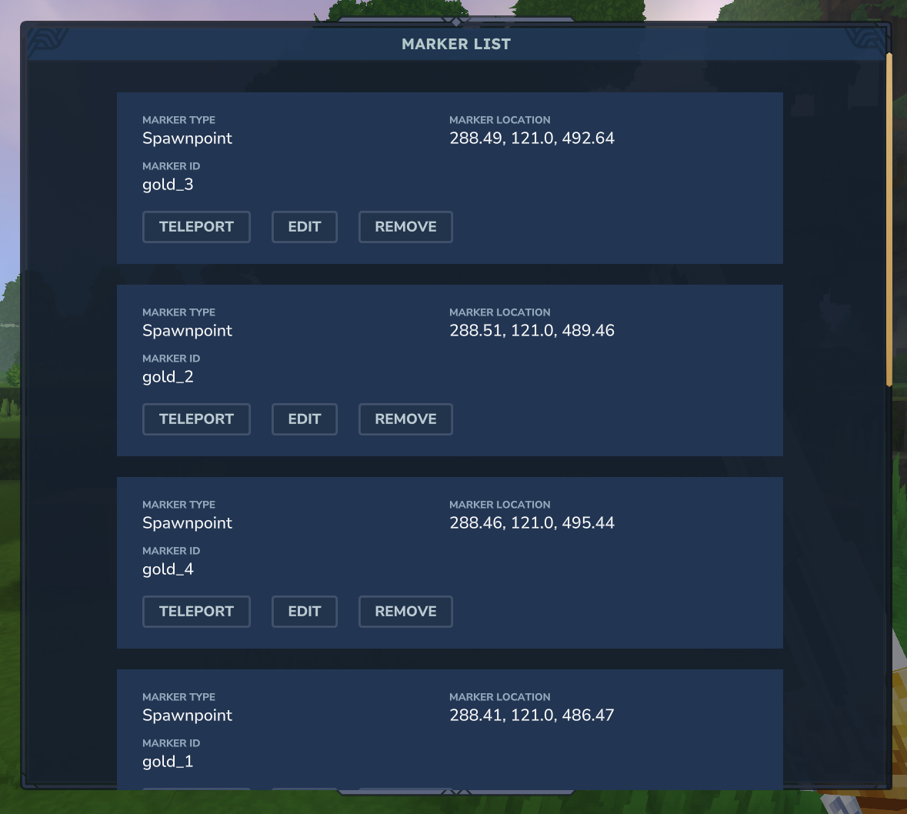
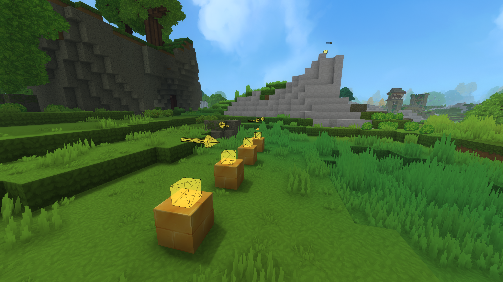

# hytale-markers
Adds a general-purpose location storage to Hytale worlds for plugin development.

They are used to define game data in the world, from player and entity spawnpoints to any other localized object.

## How do you set them up?
You can set them up through the /marker command. You can also use the aliases: markers, m
Here is the marker command structure:

- `/marker`
    - `create`
        - Creates a marker on your current location and opens a menu that allows you to define the marker type, id and data.
    - `list`
        - Opens a menu of all the markers in your current world, sorted by distance.
    - `reveal`
        - Reveals every marker in the world.
    - `data`
        - `add`
            - Stores the provided value on the provided key in the marker's data map.
            - Parameters:
                - `markerId`: Marker to add this data to.
                - `key`: Key for this value.
                - `value`: Value to save on the key.
        - `remove`
            - Removes the data held in the provided key on this marker.
            - Parameters:
                - `markerId`: Marker to remove this data from.
                - `key`: Key for the data you want to remove.


_Marker List menu, opened by executing the command `/m list`._

Most of this commands can be ignored and you can easily work with markers by using the list and create commands. You can also use the Marker Editor item to right click the block below a marker to edit it, but you may need to reveal them first for ease of use.


_Revealed markers through the `/m reveal` command. Small cube is the location and arrow displays its rotation._

## What is the id and type of a Marker?
The type of the marker will be simple text provided by the developer who will implement the feature. For example: "Player_Spawnpoint".

The marker id is a unique identifier for this marker. If this specific marker doesn't need to be referenced or identified necessarily, it can't be left empty to generate a random id.

Some things to note:
- A marker id can always be changed later.
- Using an existing id on marker creation/editing will override the already existing marker.

## What is the marker data for?
The data fields can be used to add any extra data we might want to that location. Think of it as an object or entity that contains all we would want to know about it.

Let's say you're building a team minigame. You could use different Marker Types for each team's spawnpoints or you could use a `Player_Spawnpoint` marker with a `Team` key on its data.
Then you could filter which spawnpoints belong to which team by reading the data map.

This is a very flexible system that lets you save essentially anything and attach it to that specific marker.

Another example is an NPCs plugin where you have hundreds of NPCs, you wouldn't want to use a different `markerType` or `markerId` for each NPC.
You could set up an `NPC_Spawnpoint` marker and define which NPC it spawns on its data map.

## How do I access the markers on my world?
Firstly, you'll need to register all the needed components, systems and commands using the `LocationMarkerSystemsRegistrar` class.

```
class ExamplePlugin(init: JavaPluginInit) : JavaPlugin(init) {

    lateinit var markerRegistrar: LocationMarkerSystemsRegistrar

    override fun setup() {
        markerRegistrar = LocationMarkerSystemsRegistrar(this, true)
    }

}
```

Then you'll be able to access a world's markers by using the world's chunkStore.
```
world.chunkStore.store.getResource(markerRegistrar.markerResourceType).getMarkers()
```

You can even filter through types in the resource directly.
```
val PLAYER_SPAWNPOINTS_TYPE: String = "Player_Spawnpoint"

world.chunkStore.store.getResource(markerRegistrar.markerResourceType).getMarkers(PLAYER_SPAWNPOINTS_TYPE)
```

All LocationMarker objects are mutable, so if you change their id, type, location or data, it will be eventually saved and kept.

You can also use the resource to add your own markers to the world:

```
val markerResource = world.chunkStore.store.getResource(markerRegistrar.markerResourceType)

markerResource.addMarker(LocationMarker(...))
```

Hytale takes care of saving the marker data into the world's files automatically.